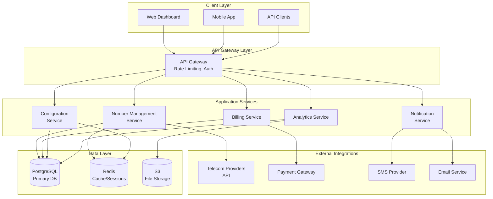

# Design Document

## Overview

The Virtual Phone Number Management System is designed as a cloud-native, microservices-based platform that provides businesses with seamless virtual phone number acquisition and management capabilities. The system leverages modern web technologies and integrates with telecommunications providers to deliver enterprise-grade functionality through VoxLink's signature simple and intuitive interface.

The architecture prioritizes scalability, reliability, and global accessibility while maintaining the brand's core values of simplicity and professional communication excellence. The system will handle number inventory management, real-time provisioning, call routing configuration, and comprehensive analytics.

## Architecture

### High-Level System Architecture



### Technology Stack

**Frontend:**
- React 18 with TypeScript for web dashboard
- React Native for mobile applications
- Tailwind CSS for styling (using VoxLink brand colors)
- React Query for state management and API caching

**Backend:**
- Node.js with Express.js for API services
- TypeScript for type safety
- PostgreSQL for primary data storage
- Redis for caching and session management
- AWS S3 for file storage and backups

**Infrastructure:**
- AWS ECS for container orchestration
- AWS Application Load Balancer
- AWS RDS for managed PostgreSQL
- AWS ElastiCache for managed Redis
- AWS CloudWatch for monitoring and logging

## Components and Interfaces

### Number Management Service

**Core Responsibilities:**
- Number inventory management and availability checking
- Integration with telecom provider APIs
- Number reservation and purchase processing
- Number activation and deactivation
- Porting process coordination

**Key APIs:**
```typescript
interface NumberManagementAPI {
  searchNumbers(criteria: SearchCriteria): Promise<AvailableNumber[]>
  reserveNumber(numberId: string): Promise<ReservationResult>
  purchaseNumber(reservationId: string, paymentInfo: PaymentInfo): Promise<PurchaseResult>
  activateNumber(numberId: string, config: NumberConfig): Promise<ActivationResult>
  deactivateNumber(numberId: string): Promise<DeactivationResult>
  initiatePorting(portingRequest: PortingRequest): Promise<PortingResult>
}
```

### Configuration Service

**Core Responsibilities:**
- Call routing rule management
- Business hours configuration
- Voicemail settings management
- Notification preferences
- Integration with call handling systems

**Key APIs:**
```typescript
interface ConfigurationAPI {
  updateCallRouting(numberId: string, rules: RoutingRules): Promise<ConfigResult>
  setBusinessHours(numberId: string, schedule: BusinessSchedule): Promise<ConfigResult>
  configureVoicemail(numberId: string, settings: VoicemailSettings): Promise<ConfigResult>
  updateNotifications(userId: string, preferences: NotificationPrefs): Promise<ConfigResult>
}
```

### Billing Service

**Core Responsibilities:**
- Usage tracking and metering
- Invoice generation and payment processing
- Cost analytics and reporting
- Subscription management
- Payment method management

**Key APIs:**
```typescript
interface BillingAPI {
  trackUsage(numberId: string, usage: UsageEvent): Promise<void>
  generateInvoice(accountId: string, period: BillingPeriod): Promise<Invoice>
  processPayment(invoiceId: string): Promise<PaymentResult>
  getCostAnalytics(accountId: string, period: DateRange): Promise<CostAnalytics>
}
```

## Data Models

### Core Entities

```typescript
interface VirtualNumber {
  id: string
  phoneNumber: string
  countryCode: string
  areaCode: string
  city: string
  region: string
  status: 'available' | 'reserved' | 'active' | 'suspended' | 'porting'
  ownerId: string
  purchaseDate: Date
  activationDate?: Date
  monthlyRate: number
  setupFee: number
  features: NumberFeature[]
  configuration: NumberConfiguration
  createdAt: Date
  updatedAt: Date
}

interface NumberConfiguration {
  id: string
  numberId: string
  callForwarding: CallForwardingConfig
  voicemail: VoicemailConfig
  businessHours: BusinessHoursConfig
  notifications: NotificationConfig
  createdAt: Date
  updatedAt: Date
}

interface CallForwardingConfig {
  enabled: boolean
  primaryDestination: string
  failoverDestination?: string
  businessHoursDestination?: string
  afterHoursDestination?: string
  timeout: number
}

interface BusinessHoursConfig {
  timezone: string
  schedule: {
    [day: string]: {
      open: string
      close: string
      enabled: boolean
    }
  }
  holidays: Date[]
}

interface UsageRecord {
  id: string
  numberId: string
  eventType: 'inbound_call' | 'outbound_call' | 'sms_received' | 'sms_sent'
  duration?: number
  cost: number
  timestamp: Date
  metadata: Record<string, any>
}

interface PortingRequest {
  id: string
  userId: string
  currentNumber: string
  currentCarrier: string
  accountNumber: string
  pin: string
  authorizedName: string
  status: 'submitted' | 'processing' | 'approved' | 'completed' | 'failed'
  estimatedCompletion: Date
  documents: string[]
  createdAt: Date
  updatedAt: Date
}
```

### Database Schema Design

**Numbers Table:**
- Primary key: id (UUID)
- Indexes: phone_number (unique), owner_id, status, country_code + area_code
- Partitioning: By country_code for global scalability

**Configurations Table:**
- Primary key: id (UUID)
- Foreign key: number_id references numbers(id)
- Indexes: number_id (unique)

**Usage Records Table:**
- Primary key: id (UUID)
- Foreign key: number_id references numbers(id)
- Indexes: number_id + timestamp, event_type + timestamp
- Partitioning: By month for efficient querying and archival

## Error Handling

### Error Categories and Responses

**Validation Errors (400):**
- Invalid phone number format
- Unsupported country/region
- Missing required configuration parameters

**Authentication/Authorization Errors (401/403):**
- Invalid API credentials
- Insufficient permissions for number management
- Account suspension or billing issues

**Resource Errors (404/409):**
- Number not found or no longer available
- Configuration conflicts
- Duplicate reservation attempts

**External Service Errors (502/503):**
- Telecom provider API failures
- Payment gateway timeouts
- SMS/Email delivery failures

**Rate Limiting (429):**
- API request limits exceeded
- Number search throttling
- Bulk operation limits

### Error Response Format

```typescript
interface ErrorResponse {
  error: {
    code: string
    message: string
    details?: Record<string, any>
    timestamp: string
    requestId: string
  }
}
```

### Retry and Fallback Strategies

- **Number Search:** Fallback to cached results if provider API is unavailable
- **Number Activation:** Automatic retry with exponential backoff (max 3 attempts)
- **Configuration Updates:** Queue changes for retry if call routing service is down
- **Notifications:** Multiple delivery channels with fallback (email → SMS → push)

## Testing Strategy

### Unit Testing
- **Coverage Target:** 90% code coverage for all services
- **Framework:** Jest with TypeScript support
- **Focus Areas:** Business logic, data validation, error handling
- **Mocking:** External API calls, database operations, third-party services

### Integration Testing
- **Database Integration:** Test with real PostgreSQL instance using test containers
- **API Integration:** Test service-to-service communication
- **External Services:** Mock telecom provider APIs with realistic responses
- **End-to-End Workflows:** Number purchase, activation, and configuration flows

### Performance Testing
- **Load Testing:** Simulate concurrent number searches and purchases
- **Stress Testing:** Test system behavior under high API request volumes
- **Database Performance:** Query optimization and index effectiveness
- **Caching Effectiveness:** Redis cache hit rates and response times

### User Acceptance Testing
- **Number Search Experience:** Search speed and result relevance
- **Purchase Flow:** Complete number acquisition process
- **Configuration Interface:** Call routing setup and testing
- **Dashboard Usability:** Number management and analytics views

### Monitoring and Observability
- **Application Metrics:** API response times, error rates, throughput
- **Business Metrics:** Number activation success rates, user engagement
- **Infrastructure Metrics:** Database performance, cache utilization
- **Alerting:** Critical error notifications, performance degradation alerts

### Security Testing
- **Authentication:** JWT token validation and expiration
- **Authorization:** Role-based access control for number management
- **Data Protection:** PII encryption and secure data transmission
- **API Security:** Rate limiting, input validation, SQL injection prevention