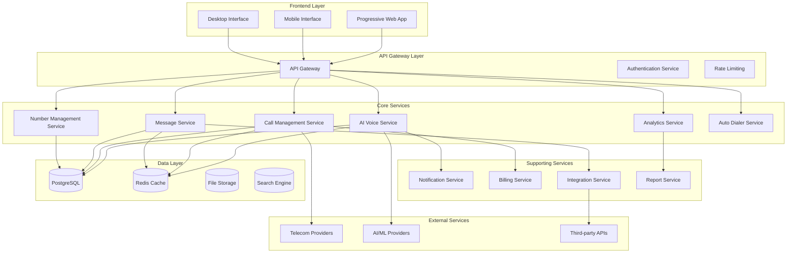

# VoxLink Platform Restructure Design Document

## Overview

The VoxLink platform restructure transforms the existing virtual phone number management system into a comprehensive AI-powered business communication platform. The design follows modern microservices architecture with Progressive Web App capabilities, real-time communication, and extensive third-party integrations. The platform will serve as a unified hub for voice, SMS, and digital communications with advanced AI capabilities and analytics.

## Architecture

### High-Level Architecture



### Technology Stack

**Frontend Technologies:**
- React 18 with TypeScript
- Vite for build tooling
- Tailwind CSS for styling
- Socket.io client for real-time updates
- Service Workers for PWA functionality
- IndexedDB for offline storage

**Backend Technologies:**
- Node.js with Express/Fastify
- TypeScript for type safety
- Prisma ORM for database management
- Socket.io for real-time communication
- Redis for caching and session management
- Bull Queue for job processing

**Infrastructure:**
- Docker containers for deployment
- AWS ECS for container orchestration
- PostgreSQL for primary database
- Redis for caching and real-time features
- AWS S3 for file storage
- CloudFront CDN for global content delivery

## Components and Interfaces

### Frontend Component Structure

```
packages/dashboard/src/
├── components/
│   ├── Layout/
│   │   ├── Sidebar.tsx              # Main navigation sidebar
│   │   ├── Header.tsx               # Top navigation header
│   │   ├── Layout.tsx               # Main layout wrapper
│   │   └── ResponsiveLayout.tsx     # Mobile-responsive layout
│   ├── AIAgent/
│   │   ├── AgentBuilder.tsx         # AI agent configuration
│   │   ├── WorkflowDesigner.tsx     # Visual workflow builder
│   │   ├── VoiceSettings.tsx        # Voice parameter controls
│   │   └── ConversationFlow.tsx     # Conversation logic builder
│   ├── Inbox/
│   │   ├── UnifiedInbox.tsx         # Main inbox interface
│   │   ├── MessageThread.tsx        # Individual conversation view
│   │   ├── ChannelManager.tsx       # Communication channel setup
│   │   ├── TemplateEditor.tsx       # Message template creator
│   │   └── CampaignBuilder.tsx      # Marketing campaign setup
│   ├── Reports/
│   │   ├── ReportDashboard.tsx      # Main reporting interface
│   │   ├── CallAnalytics.tsx        # Call performance metrics
│   │   ├── UserPerformance.tsx      # Agent performance tracking
│   │   ├── LeaderBoard.tsx          # Performance rankings
│   │   └── ReportExporter.tsx       # Report export functionality
│   ├── Numbers/
│   │   ├── NumberInventory.tsx      # Number management interface
│   │   ├── DIDGroupManager.tsx      # DID group organization
│   │   ├── NumberPurchase.tsx       # Number acquisition interface
│   │   └── RoutingConfig.tsx        # Call routing configuration
│   ├── Dialer/
│   │   ├── PowerDialer.tsx          # Power dialer interface
│   │   ├── ParallelDialer.tsx       # Parallel dialer controls
│   │   ├── SpeedDial.tsx            # Speed dial management
│   │   └── DialerSettings.tsx       # Dialer configuration
│   └── Common/
│       ├── DataTable.tsx            # Reusable data table
│       ├── Chart.tsx                # Chart components
│       ├── Modal.tsx                # Modal dialogs
│       └── LoadingSpinner.tsx       # Loading indicators
├── pages/
│   ├── Dashboard/
│   │   └── Dashboard.tsx            # Main dashboard page
│   ├── AIAgent/
│   │   ├── AIAgents.tsx             # AI agent management
│   │   ├── VoiceWorkflows.tsx       # Workflow management
│   │   ├── CallLogs.tsx             # AI call history
│   │   └── Integrations.tsx         # AI integrations
│   ├── Inbox/
│   │   ├── SMSChats.tsx             # SMS/chat interface
│   │   ├── Channels.tsx             # Channel management
│   │   ├── Templates.tsx            # Template management
│   │   ├── WorkflowBuilder.tsx      # Message workflow builder
│   │   ├── AIHub.tsx                # AI-powered messaging
│   │   └── Campaign.tsx             # Campaign management
│   ├── Reports/
│   │   ├── CallStatusReport.tsx     # Call status analytics
│   │   ├── AbandonRateReport.tsx    # Call abandon metrics
│   │   ├── OutgoingCallReport.tsx   # Outbound call analytics
│   │   ├── UserStatusReport.tsx     # User activity reports
│   │   ├── CallReport.tsx           # General call reports
│   │   ├── CallDispositionReport.tsx # Call outcome tracking
│   │   ├── LeaderBoard.tsx          # Performance leaderboard
│   │   └── SMSMMSReport.tsx         # Messaging analytics
│   ├── Numbers/
│   │   ├── Numbers.tsx              # Number management
│   │   └── DIDGroups.tsx            # DID group management
│   └── AutoDialer/
│       ├── PowerDialer.tsx          # Power dialer page
│       ├── ParallelDialer.tsx       # Parallel dialer page
│       └── SpeedDial.tsx            # Speed dial page
├── services/
│   ├── api.ts                       # API client configuration
│   ├── websocket.ts                 # WebSocket connection management
│   ├── offline.ts                   # Offline functionality
│   ├── notifications.ts             # Push notification handling
│   └── analytics.ts                 # Analytics tracking
├── hooks/
│   ├── useRealtime.ts               # Real-time data hooks
│   ├── useOffline.ts                # Offline state management
│   ├── useResponsive.ts             # Responsive design hooks
│   └── useAnalytics.ts              # Analytics hooks
└── utils/
    ├── auth.ts                      # Authentication utilities
    ├── formatting.ts                # Data formatting helpers
    ├── validation.ts                # Form validation
    └── constants.ts                 # Application constants
```

### Backend Service Architecture

**AI Voice Service:**
- Agent configuration management
- Voice workflow execution
- Natural language processing integration
- Call routing and escalation logic
- Performance analytics and optimization

**Call Management Service:**
- Real-time call handling
- Call recording and storage
- Call quality monitoring
- Conference call management
- Call disposition tracking

**Message Service:**
- Unified inbox management
- Multi-channel message routing
- Template and automation engine
- Campaign management
- Message analytics

**Auto Dialer Service:**
- Power dialer implementation
- Parallel dialing coordination
- Speed dial management
- Compliance and DNC list checking
- Dialer performance optimization

### API Design

**RESTful API Endpoints:**

```typescript
// AI Agent Management
GET    /api/v1/ai-agents
POST   /api/v1/ai-agents
PUT    /api/v1/ai-agents/:id
DELETE /api/v1/ai-agents/:id

// Voice Workflows
GET    /api/v1/workflows
POST   /api/v1/workflows
PUT    /api/v1/workflows/:id
DELETE /api/v1/workflows/:id

// Unified Inbox
GET    /api/v1/inbox/messages
POST   /api/v1/inbox/messages
PUT    /api/v1/inbox/messages/:id
DELETE /api/v1/inbox/messages/:id

// Reports and Analytics
GET    /api/v1/reports/call-status
GET    /api/v1/reports/abandon-rate
GET    /api/v1/reports/user-performance
GET    /api/v1/reports/sms-mms
POST   /api/v1/reports/export

// Auto Dialer
POST   /api/v1/dialer/power/start
POST   /api/v1/dialer/power/stop
POST   /api/v1/dialer/parallel/start
POST   /api/v1/dialer/parallel/stop
GET    /api/v1/dialer/speed-dial
POST   /api/v1/dialer/speed-dial
```

**WebSocket Events:**

```typescript
// Real-time call events
'call:incoming'
'call:answered'
'call:ended'
'call:transferred'

// Agent status updates
'agent:online'
'agent:offline'
'agent:busy'
'agent:available'

// Message events
'message:received'
'message:sent'
'message:read'

// System notifications
'system:alert'
'system:maintenance'
'system:update'
```

## Data Models

### Core Data Entities

```typescript
// AI Agent Configuration
interface AIAgent {
  id: string;
  name: string;
  description: string;
  voiceSettings: {
    voice: string;
    speed: number;
    pitch: number;
    language: string;
  };
  workflows: WorkflowStep[];
  integrations: Integration[];
  performance: AgentPerformance;
  createdAt: Date;
  updatedAt: Date;
}

// Voice Workflow Definition
interface VoiceWorkflow {
  id: string;
  name: string;
  description: string;
  steps: WorkflowStep[];
  conditions: WorkflowCondition[];
  escalationRules: EscalationRule[];
  analytics: WorkflowAnalytics;
  isActive: boolean;
  createdAt: Date;
  updatedAt: Date;
}

// Unified Message
interface UnifiedMessage {
  id: string;
  threadId: string;
  channel: 'sms' | 'chat' | 'email' | 'voice';
  direction: 'inbound' | 'outbound';
  content: string;
  metadata: Record<string, any>;
  status: 'pending' | 'sent' | 'delivered' | 'read' | 'failed';
  timestamp: Date;
  agentId?: string;
  customerId: string;
}

// Call Record
interface CallRecord {
  id: string;
  callId: string;
  direction: 'inbound' | 'outbound';
  fromNumber: string;
  toNumber: string;
  duration: number;
  status: 'completed' | 'abandoned' | 'failed' | 'busy';
  disposition: string;
  recordingUrl?: string;
  agentId?: string;
  aiAgentId?: string;
  metadata: Record<string, any>;
  startTime: Date;
  endTime?: Date;
}

// Dialer Campaign
interface DialerCampaign {
  id: string;
  name: string;
  type: 'power' | 'parallel' | 'speed';
  contactList: Contact[];
  settings: DialerSettings;
  status: 'active' | 'paused' | 'completed';
  statistics: CampaignStatistics;
  createdAt: Date;
  updatedAt: Date;
}

// Report Configuration
interface ReportConfig {
  id: string;
  name: string;
  type: 'call-status' | 'abandon-rate' | 'user-performance' | 'sms-mms';
  filters: ReportFilter[];
  schedule?: ReportSchedule;
  recipients: string[];
  format: 'pdf' | 'csv' | 'excel';
  createdAt: Date;
  updatedAt: Date;
}
```

### Database Schema Design

```sql
-- AI Agents table
CREATE TABLE ai_agents (
  id UUID PRIMARY KEY DEFAULT gen_random_uuid(),
  name VARCHAR(255) NOT NULL,
  description TEXT,
  voice_settings JSONB NOT NULL,
  workflows JSONB NOT NULL,
  integrations JSONB DEFAULT '[]',
  performance JSONB DEFAULT '{}',
  is_active BOOLEAN DEFAULT true,
  created_at TIMESTAMP DEFAULT NOW(),
  updated_at TIMESTAMP DEFAULT NOW()
);

-- Voice Workflows table
CREATE TABLE voice_workflows (
  id UUID PRIMARY KEY DEFAULT gen_random_uuid(),
  name VARCHAR(255) NOT NULL,
  description TEXT,
  steps JSONB NOT NULL,
  conditions JSONB DEFAULT '[]',
  escalation_rules JSONB DEFAULT '[]',
  analytics JSONB DEFAULT '{}',
  is_active BOOLEAN DEFAULT true,
  created_at TIMESTAMP DEFAULT NOW(),
  updated_at TIMESTAMP DEFAULT NOW()
);

-- Unified Messages table
CREATE TABLE unified_messages (
  id UUID PRIMARY KEY DEFAULT gen_random_uuid(),
  thread_id UUID NOT NULL,
  channel VARCHAR(50) NOT NULL,
  direction VARCHAR(20) NOT NULL,
  content TEXT NOT NULL,
  metadata JSONB DEFAULT '{}',
  status VARCHAR(50) DEFAULT 'pending',
  timestamp TIMESTAMP DEFAULT NOW(),
  agent_id UUID REFERENCES users(id),
  customer_id UUID NOT NULL,
  INDEX idx_thread_id (thread_id),
  INDEX idx_customer_id (customer_id),
  INDEX idx_timestamp (timestamp)
);

-- Call Records table
CREATE TABLE call_records (
  id UUID PRIMARY KEY DEFAULT gen_random_uuid(),
  call_id VARCHAR(255) UNIQUE NOT NULL,
  direction VARCHAR(20) NOT NULL,
  from_number VARCHAR(50) NOT NULL,
  to_number VARCHAR(50) NOT NULL,
  duration INTEGER DEFAULT 0,
  status VARCHAR(50) NOT NULL,
  disposition VARCHAR(100),
  recording_url TEXT,
  agent_id UUID REFERENCES users(id),
  ai_agent_id UUID REFERENCES ai_agents(id),
  metadata JSONB DEFAULT '{}',
  start_time TIMESTAMP NOT NULL,
  end_time TIMESTAMP,
  INDEX idx_call_id (call_id),
  INDEX idx_start_time (start_time),
  INDEX idx_agent_id (agent_id)
);

-- Dialer Campaigns table
CREATE TABLE dialer_campaigns (
  id UUID PRIMARY KEY DEFAULT gen_random_uuid(),
  name VARCHAR(255) NOT NULL,
  type VARCHAR(50) NOT NULL,
  contact_list JSONB NOT NULL,
  settings JSONB NOT NULL,
  status VARCHAR(50) DEFAULT 'active',
  statistics JSONB DEFAULT '{}',
  created_at TIMESTAMP DEFAULT NOW(),
  updated_at TIMESTAMP DEFAULT NOW()
);
```

## Error Handling

### Error Classification

**Client Errors (4xx):**
- 400 Bad Request: Invalid input data or malformed requests
- 401 Unauthorized: Authentication required or invalid credentials
- 403 Forbidden: Insufficient permissions for requested action
- 404 Not Found: Requested resource does not exist
- 429 Too Many Requests: Rate limit exceeded

**Server Errors (5xx):**
- 500 Internal Server Error: Unexpected server-side errors
- 502 Bad Gateway: Upstream service unavailable
- 503 Service Unavailable: Temporary service overload
- 504 Gateway Timeout: Upstream service timeout

### Error Response Format

```typescript
interface ErrorResponse {
  error: {
    code: string;
    message: string;
    details?: Record<string, any>;
    timestamp: string;
    requestId: string;
  };
}
```

### Error Handling Strategy

**Frontend Error Handling:**
- Global error boundary for React components
- Axios interceptors for API error handling
- Toast notifications for user-friendly error messages
- Retry mechanisms for transient failures
- Offline error handling with queue management

**Backend Error Handling:**
- Centralized error middleware
- Structured error logging with correlation IDs
- Circuit breaker pattern for external service calls
- Graceful degradation for non-critical features
- Health check endpoints for service monitoring

## Testing Strategy

### Testing Pyramid

**Unit Tests (70%):**
- Component testing with React Testing Library
- Service layer testing with Jest
- Utility function testing
- Database model testing
- API endpoint testing

**Integration Tests (20%):**
- API integration testing
- Database integration testing
- Third-party service integration testing
- WebSocket connection testing
- Authentication flow testing

**End-to-End Tests (10%):**
- Critical user journey testing
- Cross-browser compatibility testing
- Mobile responsiveness testing
- Performance testing under load
- Security penetration testing

### Testing Tools and Frameworks

**Frontend Testing:**
- Jest for unit testing
- React Testing Library for component testing
- Cypress for end-to-end testing
- Storybook for component documentation
- Lighthouse for performance testing

**Backend Testing:**
- Jest for unit and integration testing
- Supertest for API testing
- Testcontainers for database testing
- Artillery for load testing
- OWASP ZAP for security testing

### Continuous Integration

```yaml
# GitHub Actions workflow
name: VoxLink CI/CD
on: [push, pull_request]

jobs:
  test:
    runs-on: ubuntu-latest
    steps:
      - uses: actions/checkout@v3
      - uses: actions/setup-node@v3
      - run: npm ci
      - run: npm run test:unit
      - run: npm run test:integration
      - run: npm run test:e2e
      - run: npm run build
      - run: npm run security:scan
```

### Performance Testing

**Load Testing Scenarios:**
- Concurrent user simulation (1000+ users)
- High-volume call processing (100+ calls/minute)
- Message throughput testing (1000+ messages/minute)
- Database query performance under load
- Real-time WebSocket connection scaling

**Performance Metrics:**
- Response time < 200ms for API calls
- Page load time < 2 seconds
- WebSocket message latency < 100ms
- Database query time < 50ms
- 99.9% uptime availability

This design provides a comprehensive foundation for restructuring the VoxLink platform into a modern, scalable, and feature-rich business communication platform with AI capabilities, real-time functionality, and extensive integration options.