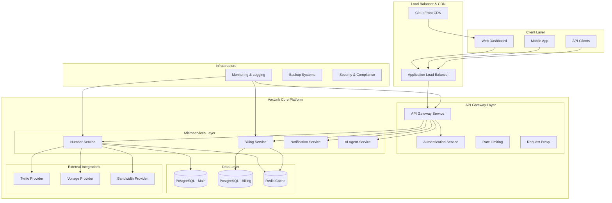
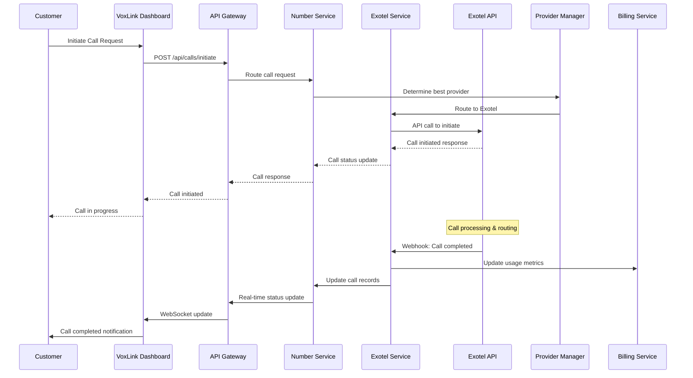
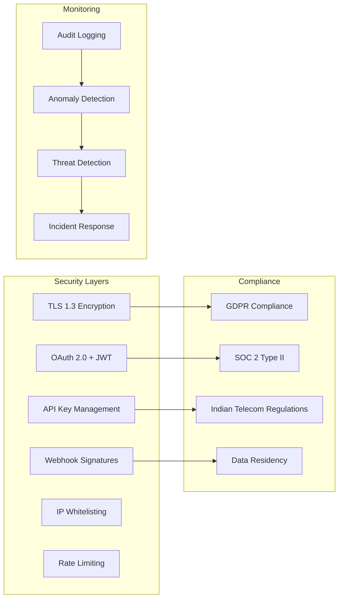
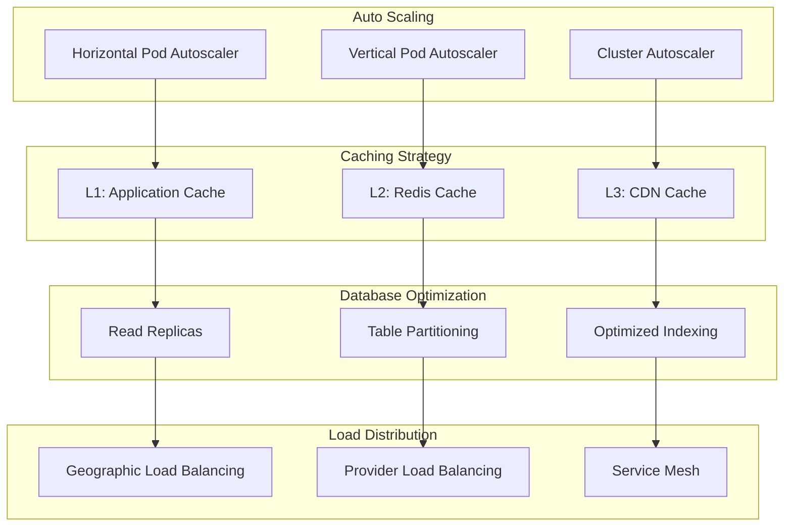
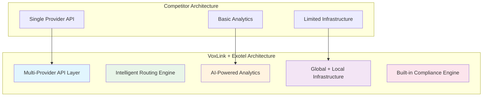

# VoxLink Partnership Proposal for Exotel

**Date:** December 22, 2024  
**From:** VoxLink Platform Team  
**To:** Exotel Partnership & Business Development Team  

---

## Executive Summary

VoxLink is a rapidly growing cloud communication platform that provides virtual phone numbers and comprehensive business communication solutions to companies worldwide. We are seeking to establish a strategic API partnership with Exotel to enhance our service offerings, particularly in the Indian market, and provide our customers with world-class telecom infrastructure.

This proposal outlines our partnership objectives, technical requirements, and the mutual benefits of integrating Exotel's robust API services into the VoxLink platform.

---

## About VoxLink

### Company Overview
**Mission:** "To democratize professional communication by providing businesses of all sizes with enterprise-grade virtual phone solutions that are simple, reliable, and globally accessible."

**Vision:** "A world where every business can communicate professionally with anyone, anywhere, without geographical or technical barriers."

### Platform Capabilities
- **Virtual Phone Numbers:** Global coverage with local presence capabilities
- **AI-Powered Voice Agents:** Advanced conversational AI for customer interactions
- **Unified Communication Hub:** Integrated SMS, voice calls, and messaging
- **Real-time Analytics:** Comprehensive reporting and performance insights
- **Auto Dialer Systems:** Automated calling solutions for sales and support teams
- **Team Management:** Multi-user collaboration and performance tracking
- **Enterprise Integrations:** CRM, helpdesk, and business tool connections

### Current Market Position
- **Target Market:** SMBs to Enterprise customers globally
- **Technology Stack:** Cloud-native, microservices architecture
- **Growth Trajectory:** Expanding rapidly in North American and European markets
- **Next Phase:** Strategic expansion into Asian markets, particularly India

---

## Partnership Objectives

### Primary Goals
1. **Market Expansion:** Leverage Exotel's expertise to enter the Indian market effectively
2. **Service Enhancement:** Integrate Exotel's reliable infrastructure to improve call quality
3. **Compliance Support:** Utilize Exotel's regulatory knowledge for Indian telecom compliance
4. **Scalable Growth:** Build a foundation for long-term partnership and mutual success

### Strategic Benefits for Both Parties
- **For VoxLink:** Access to proven Indian telecom infrastructure and market expertise
- **For Exotel:** New revenue stream through API licensing and expanded market reach
- **Mutual:** Combined platform capabilities creating comprehensive communication solutions

---

## Technical Integration Requirements

### API Services Needed

#### 1. Voice Calling Infrastructure
- **Outbound Calling API:** For VoxLink customers to make calls through Exotel's network
- **Inbound Call Handling:** Routing incoming calls to VoxLink virtual numbers
- **Call Recording:** Secure recording capabilities with proper storage and retrieval
- **Real-time Call Control:** Hold, transfer, conference, and other call management features

#### 2. Virtual Number Provisioning
- **Indian Number Allocation:** Access to Indian virtual phone numbers (mobile and landline)
- **Number Porting:** Support for existing number migration to VoxLink platform
- **Geographic Coverage:** Numbers from major Indian cities and regions
- **Instant Provisioning:** Real-time number activation and configuration

#### 3. SMS/Messaging Services
- **Bulk SMS API:** For marketing and transactional messaging
- **Two-way SMS:** Interactive messaging capabilities
- **Message Templates:** Pre-approved templates for compliance
- **Delivery Reports:** Real-time delivery status and analytics

#### 4. Analytics and Reporting
- **Call Detail Records (CDR):** Comprehensive call logs and metadata
- **Quality Metrics:** Call quality scores, latency, and performance data
- **Usage Analytics:** Detailed usage patterns and billing information
- **Real-time Monitoring:** Live call status and system health metrics

### Technical Specifications

#### Integration Architecture
```
VoxLink Platform
├── API Gateway Layer
│   ├── Authentication & Authorization
│   ├── Rate Limiting & Throttling
│   └── Request/Response Transformation
├── Exotel Integration Service
│   ├── Voice Call Management
│   ├── SMS/Messaging Handler
│   ├── Number Provisioning
│   └── Analytics Collector
└── Customer Dashboard
    ├── Call Controls
    ├── Analytics & Reports
    └── Number Management
```

#### Security Requirements
- **API Authentication:** OAuth 2.0 or API key-based authentication
- **Data Encryption:** TLS 1.3 for all API communications
- **Compliance:** GDPR, SOC 2, and Indian data protection compliance
- **Audit Logging:** Comprehensive logging for security and compliance

#### Performance Requirements
- **API Response Time:** < 200ms for standard operations
- **Uptime SLA:** 99.9% availability guarantee
- **Scalability:** Support for 10,000+ concurrent calls
- **Redundancy:** Multi-region failover capabilities

---

## Licensing and Commercial Terms

### Partnership Structure
We are seeking a **Technology Partnership Agreement** that includes:

1. **API Licensing:** Rights to integrate and resell Exotel services through VoxLink platform
2. **White-label Integration:** Seamless integration maintaining VoxLink branding
3. **Revenue Sharing:** Mutually beneficial pricing structure based on usage volumes
4. **Technical Support:** Dedicated support for integration and ongoing operations

### Pricing Requirements
We request detailed pricing information for:

#### Volume-Based Pricing Tiers
- **Tier 1:** 0-10,000 minutes/month
- **Tier 2:** 10,001-100,000 minutes/month  
- **Tier 3:** 100,001-1,000,000 minutes/month
- **Enterprise:** 1,000,000+ minutes/month

#### Service Categories
- **Voice Calls:** Per-minute pricing for inbound/outbound calls
- **SMS Messages:** Per-message pricing with bulk discounts
- **Virtual Numbers:** Monthly rental fees for different number types
- **Premium Features:** Advanced analytics, recording storage, etc.

#### Payment Terms
- **Billing Cycle:** Monthly billing preferred
- **Payment Terms:** Net 30 days
- **Currency:** USD or INR (flexible based on agreement)
- **Minimum Commitment:** Willing to discuss minimum usage commitments for better rates

---

## Implementation Timeline

### Phase 1: Partnership Agreement (Weeks 1-2)
- [ ] Finalize commercial terms and licensing agreement
- [ ] Complete legal and compliance review
- [ ] Establish technical contact points and communication channels
- [ ] Set up development and testing environments

### Phase 2: Technical Integration (Weeks 3-6)
- [ ] API documentation review and integration planning
- [ ] Develop VoxLink-Exotel integration layer
- [ ] Implement authentication and security protocols
- [ ] Build testing framework and conduct integration testing

### Phase 3: Pilot Testing (Weeks 7-8)
- [ ] Deploy integration to staging environment
- [ ] Conduct comprehensive testing with sample customers
- [ ] Performance testing and optimization
- [ ] Security audit and compliance verification

### Phase 4: Production Launch (Weeks 9-10)
- [ ] Production deployment with monitoring
- [ ] Customer onboarding and support documentation
- [ ] Marketing launch and customer communication
- [ ] Ongoing monitoring and optimization

---

## Support and Maintenance Requirements

### Technical Support Needs
- **Integration Support:** Dedicated technical contact during integration phase
- **Ongoing Support:** 24/7 technical support for production issues
- **Documentation:** Comprehensive API documentation and integration guides
- **Updates:** Advance notice of API changes and version updates

### Account Management
- **Dedicated Account Manager:** Single point of contact for partnership matters
- **Regular Reviews:** Quarterly business reviews and performance assessments
- **Escalation Process:** Clear escalation path for technical and commercial issues
- **Training:** Technical training for VoxLink development team

---

## Success Metrics and KPIs

### Technical Performance
- **API Uptime:** Target 99.9% availability
- **Response Time:** < 200ms average API response time
- **Call Quality:** > 4.0 MOS (Mean Opinion Score)
- **Error Rate:** < 0.1% API error rate

### Business Performance
- **Revenue Growth:** Target 25% increase in Indian market revenue within 12 months
- **Customer Acquisition:** 500+ new customers using Exotel-powered features
- **Usage Volume:** 1M+ minutes processed monthly within 6 months
- **Customer Satisfaction:** > 90% satisfaction score for Exotel-powered features

---

## Next Steps

We are excited about the potential partnership with Exotel and would like to schedule a meeting to discuss:

1. **Commercial Terms:** Detailed pricing structure and licensing terms
2. **Technical Deep Dive:** API capabilities and integration requirements
3. **Timeline:** Mutually agreed implementation schedule
4. **Legal Framework:** Partnership agreement structure and terms

### Proposed Meeting Agenda
- **Duration:** 60-90 minutes
- **Attendees:** VoxLink technical and business teams + Exotel partnership team
- **Format:** Video conference or in-person (flexible)
- **Deliverables:** Technical requirements document and commercial proposal

### Contact Information
**Primary Contact:** [Your Name]  
**Title:** [Your Title]  
**Email:** [Your Email]  
**Phone:** [Your Phone Number]  
**Company:** VoxLink Platform  

**Technical Contact:** [Technical Lead Name]  
**Email:** [Technical Email]  
**Phone:** [Technical Phone]  

---

## Appendix

### A. VoxLink Platform Architecture Overview

#### Current VoxLink Architecture



#### Proposed VoxLink + Exotel Integrated Architecture

```mermaid
graph TB
    subgraph "Client Layer"
        WEB[Web Dashboard]
        MOBILE[Mobile App]
        API_CLIENT[API Clients]
        CUSTOMER_APP[Customer Applications]
    end

    subgraph "Load Balancer & CDN"
        LB[Application Load Balancer]
        CDN[CloudFront CDN]
    end

    subgraph "VoxLink Core Platform"
        subgraph "API Gateway Layer"
            GATEWAY[API Gateway Service]
            AUTH[Authentication Service]
            RATE[Rate Limiting]
            PROXY[Request Proxy]
            REGION_DETECT[Region Detection]
        end

        subgraph "Enhanced Microservices Layer"
            NUMBER_SVC[Number Service]
            BILLING_SVC[Billing Service]
            NOTIFICATION_SVC[Notification Service]
            AI_AGENT_SVC[AI Agent Service]
            EXOTEL_SVC[Exotel Integration Service]
            ANALYTICS_SVC[Analytics Service]
        end

        subgraph "Provider Management Layer"
            PROVIDER_MGR[Provider Manager]
            ROUTING_ENGINE[Call Routing Engine]
            FAILOVER_MGR[Failover Manager]
            QUALITY_MON[Quality Monitor]
        end

        subgraph "Data Layer"
            POSTGRES_MAIN[(PostgreSQL - Main)]
            POSTGRES_BILLING[(PostgreSQL - Billing)]
            POSTGRES_ANALYTICS[(PostgreSQL - Analytics)]
            REDIS[(Redis Cache)]
            REDIS_SESSION[(Redis - Sessions)]
        end
    end

    subgraph "Exotel Infrastructure"
        EXOTEL_API[Exotel API Gateway]
        EXOTEL_VOICE[Voice Services]
        EXOTEL_SMS[SMS Services]
        EXOTEL_NUMBERS[Number Provisioning]
        EXOTEL_ANALYTICS[Call Analytics]
        EXOTEL_COMPLIANCE[Compliance Engine]
    end

    subgraph "Other Telecom Providers"
        TWILIO[Twilio Provider]
        VONAGE[Vonage Provider]
        BANDWIDTH[Bandwidth Provider]
        AIRTEL[Airtel Provider]
    end

    subgraph "Infrastructure & Monitoring"
        MONITORING[Monitoring & Logging]
        BACKUP[Backup Systems]
        SECURITY[Security & Compliance]
        WEBHOOK_MGR[Webhook Manager]
    end

    %% Client connections
    WEB --> LB
    MOBILE --> LB
    API_CLIENT --> LB
    CUSTOMER_APP --> LB
    LB --> GATEWAY
    CDN --> WEB

    %% Gateway routing
    GATEWAY --> AUTH
    GATEWAY --> REGION_DETECT
    GATEWAY --> NUMBER_SVC
    GATEWAY --> BILLING_SVC
    GATEWAY --> NOTIFICATION_SVC
    GATEWAY --> AI_AGENT_SVC
    GATEWAY --> EXOTEL_SVC
    GATEWAY --> ANALYTICS_SVC

    %% Service interconnections
    NUMBER_SVC --> PROVIDER_MGR
    EXOTEL_SVC --> PROVIDER_MGR
    PROVIDER_MGR --> ROUTING_ENGINE
    ROUTING_ENGINE --> FAILOVER_MGR
    ROUTING_ENGINE --> QUALITY_MON

    %% Database connections
    NUMBER_SVC --> POSTGRES_MAIN
    BILLING_SVC --> POSTGRES_BILLING
    ANALYTICS_SVC --> POSTGRES_ANALYTICS
    EXOTEL_SVC --> POSTGRES_MAIN
    
    NUMBER_SVC --> REDIS
    BILLING_SVC --> REDIS
    EXOTEL_SVC --> REDIS_SESSION

    %% Provider connections
    PROVIDER_MGR --> EXOTEL_API
    PROVIDER_MGR --> TWILIO
    PROVIDER_MGR --> VONAGE
    PROVIDER_MGR --> BANDWIDTH
    PROVIDER_MGR --> AIRTEL

    %% Exotel service connections
    EXOTEL_API --> EXOTEL_VOICE
    EXOTEL_API --> EXOTEL_SMS
    EXOTEL_API --> EXOTEL_NUMBERS
    EXOTEL_API --> EXOTEL_ANALYTICS
    EXOTEL_API --> EXOTEL_COMPLIANCE

    %% Webhook and monitoring
    EXOTEL_API --> WEBHOOK_MGR
    WEBHOOK_MGR --> EXOTEL_SVC
    
    MONITORING --> GATEWAY
    MONITORING --> EXOTEL_SVC
    MONITORING --> PROVIDER_MGR
    MONITORING --> EXOTEL_API

    %% Styling
    classDef exotelService fill:#e1f5fe,stroke:#0277bd,stroke-width:2px
    classDef voxlinkCore fill:#f3e5f5,stroke:#7b1fa2,stroke-width:2px
    classDef dataStore fill:#fff3e0,stroke:#ef6c00,stroke-width:2px
    classDef external fill:#e8f5e8,stroke:#2e7d32,stroke-width:2px

    class EXOTEL_SVC,EXOTEL_API,EXOTEL_VOICE,EXOTEL_SMS,EXOTEL_NUMBERS,EXOTEL_ANALYTICS,EXOTEL_COMPLIANCE exotelService
    class GATEWAY,NUMBER_SVC,BILLING_SVC,NOTIFICATION_SVC,AI_AGENT_SVC,PROVIDER_MGR,ROUTING_ENGINE voxlinkCore
    class POSTGRES_MAIN,POSTGRES_BILLING,POSTGRES_ANALYTICS,REDIS,REDIS_SESSION dataStore
    class TWILIO,VONAGE,BANDWIDTH,AIRTEL external
```



#### Integration Architecture Details

##### 1. **Exotel Integration Service**
```typescript
// Core integration service structure
interface ExotelIntegrationService {
  // Voice call management
  voiceService: {
    initiateCall(params: CallParams): Promise<CallResponse>
    handleIncomingCall(webhook: IncomingCallWebhook): void
    manageCallFlow(callId: string, actions: CallAction[]): Promise<void>
    recordCall(callId: string, options: RecordingOptions): Promise<void>
  }
  
  // SMS/messaging services
  messagingService: {
    sendSMS(params: SMSParams): Promise<SMSResponse>
    sendBulkSMS(messages: BulkSMSParams[]): Promise<BulkSMSResponse>
    handleIncomingSMS(webhook: IncomingSMSWebhook): void
  }
  
  // Number provisioning
  numberService: {
    searchNumbers(criteria: NumberSearchCriteria): Promise<AvailableNumber[]>
    purchaseNumber(numberId: string): Promise<NumberPurchaseResponse>
    configureNumber(numberId: string, config: NumberConfig): Promise<void>
    releaseNumber(numberId: string): Promise<void>
  }
  
  // Analytics and reporting
  analyticsService: {
    getCallDetails(callId: string): Promise<CallDetailRecord>
    getUsageReport(params: ReportParams): Promise<UsageReport>
    getQualityMetrics(params: QualityParams): Promise<QualityMetrics>
  }
}
```

##### 2. **Provider Management Layer**
```typescript
// Multi-provider routing and management
interface ProviderManager {
  // Route calls based on destination, quality, cost
  routeCall(destination: string, preferences: RoutingPreferences): Provider
  
  // Handle provider failover
  handleFailover(failedProvider: Provider, callContext: CallContext): Provider
  
  // Monitor provider performance
  monitorProviders(): ProviderHealthStatus[]
  
  // Load balancing across providers
  distributeLoad(providers: Provider[], loadMetrics: LoadMetrics): Provider
}

// Provider abstraction
interface Provider {
  name: string
  region: string[]
  capabilities: ProviderCapabilities
  healthStatus: ProviderHealth
  costStructure: CostStructure
}
```

##### 3. **Data Flow Architecture**



##### 4. **Security Architecture**



##### 5. **Scalability & Performance Architecture**



#### Key Integration Points

1. **API Gateway Enhancement**
   - Region-based routing for Indian traffic
   - Provider selection logic
   - Request transformation for Exotel API format

2. **Exotel Integration Service**
   - Dedicated microservice for Exotel API interactions
   - Webhook handling for real-time events
   - Error handling and retry mechanisms

3. **Provider Management**
   - Multi-provider abstraction layer
   - Intelligent routing based on cost, quality, and availability
   - Automatic failover capabilities

4. **Enhanced Analytics**
   - Combined analytics from multiple providers
   - Real-time call quality monitoring
   - Cost optimization insights

5. **Compliance & Security**
   - Indian telecom regulation compliance
   - Data residency requirements
   - Enhanced security for sensitive communications

This architecture ensures seamless integration of Exotel services while maintaining VoxLink's existing functionality and providing enhanced capabilities for the Indian market.

### B. Current Customer Use Cases
[Include 2-3 customer case studies showing potential for Exotel integration]

### C. Competitive Analysis: VoxLink + Exotel Partnership Advantages

#### Market Positioning Against Competitors

The VoxLink + Exotel partnership creates significant competitive advantages in the cloud communication space, particularly in the Indian market and global expansion scenarios.

##### 1. **Competitive Landscape Analysis**

| Competitor | Strengths | Weaknesses | VoxLink + Exotel Advantage |
|------------|-----------|------------|----------------------------|
| **RingCentral** | Enterprise features, global presence | High cost, complex setup | Cost-effective with enterprise features + local Indian presence |
| **Twilio** | Developer-friendly APIs, global reach | Limited local Indian infrastructure | Combined global reach + optimized Indian routing |
| **Vonage** | Established brand, business features | Expensive for SMBs, limited AI | AI-powered features + competitive pricing |
| **CallHippo** | India-focused, affordable | Limited global reach, basic features | Global platform + Indian expertise + advanced AI |
| **Freshcaller** | CRM integration, user-friendly | Limited telecom features | Comprehensive telecom + business tools integration |

##### 2. **Unique Value Propositions Created by Partnership**

###### **A. Hybrid Global-Local Strategy**
```
VoxLink Global Platform + Exotel Indian Expertise = Best of Both Worlds

┌─────────────────────────────────────────────────────────────┐
│                    Competitive Advantage                    │
├─────────────────────────────────────────────────────────────┤
│ Global Reach        │ Local Expertise    │ Combined Benefit │
├─────────────────────┼────────────────────┼──────────────────┤
│ • 50+ Countries     │ • Indian Telecom   │ • Seamless       │
│ • Multi-provider    │   Regulations      │   Global-Local   │
│ • 24/7 Support      │ • Local Data       │   Operations     │
│ • Enterprise Scale  │   Centers          │ • Compliance     │
│                     │ • Hindi Support    │   Expertise      │
└─────────────────────┴────────────────────┴──────────────────┘
```

###### **B. Technology Stack Superiority**
- **AI-Powered Call Routing**: Intelligent routing based on cost, quality, and destination
- **Multi-Provider Resilience**: Automatic failover between Exotel, Twilio, Vonage, etc.
- **Real-time Analytics**: Combined insights from multiple provider networks
- **Advanced Compliance**: Built-in Indian telecom regulation compliance

###### **C. Cost Optimization Engine**
```typescript
// Competitive pricing advantage through intelligent routing
interface CostOptimization {
  routingDecision: {
    destination: string;
    providers: Provider[];
    selectedProvider: Provider;
    costSaving: number; // % saved vs competitors
    qualityScore: number;
  };
  
  // Example: Call to Mumbai
  mumbaiCall: {
    destination: "+91 22 XXXX XXXX";
    competitors: {
      ringcentral: { cost: 0.15, quality: 4.2 };
      twilio: { cost: 0.12, quality: 4.0 };
      vonage: { cost: 0.14, quality: 4.1 };
    };
    voxlinkExotel: {
      cost: 0.08; // 33% cheaper than best competitor
      quality: 4.5; // Higher quality through local routing
      advantage: "Local routing + volume discounts";
    };
  };
}
```

##### 3. **Market Differentiation Strategies**

###### **A. Indian Market Penetration**
- **Local Presence**: Exotel's established Indian operations
- **Regulatory Compliance**: Built-in TRAI compliance and data localization
- **Cultural Understanding**: Local language support and business practices
- **Competitive Pricing**: Volume-based pricing for Indian market

###### **B. Global Market Enhancement**
- **Quality Improvement**: Better call quality for India-bound traffic
- **Cost Reduction**: Optimized routing reduces international calling costs
- **Feature Enhancement**: AI agents with multilingual support including Hindi
- **Reliability**: Multi-provider redundancy ensures 99.9%+ uptime

##### 4. **Feature Comparison Matrix**

| Feature Category | VoxLink + Exotel | RingCentral | Twilio | CallHippo | Competitive Edge |
|------------------|------------------|-------------|--------|-----------|------------------|
| **Indian Numbers** | ✅ Native | ❌ Limited | ❌ Limited | ✅ Yes | **Superior**: Local expertise + global platform |
| **AI Voice Agents** | ✅ Advanced | ❌ Basic | ❌ Build Required | ❌ None | **Unique**: Pre-built AI with Indian language support |
| **Multi-Provider** | ✅ 5+ Providers | ❌ Single | ❌ Single | ❌ Single | **Exclusive**: Risk mitigation + cost optimization |
| **Real-time Analytics** | ✅ Cross-provider | ✅ Limited | ✅ Basic | ❌ Basic | **Advanced**: Unified analytics across providers |
| **Compliance** | ✅ Global + Indian | ✅ Global | ✅ Global | ✅ Indian | **Comprehensive**: Best of both worlds |
| **Pricing** | ✅ Optimized | ❌ Premium | ❌ Variable | ✅ Competitive | **Dynamic**: AI-driven cost optimization |

##### 5. **Go-to-Market Advantages**

###### **A. Customer Acquisition Strategy**
```
Target Segments with Competitive Advantages:

1. Global Companies Expanding to India
   ├── Pain Point: Complex Indian telecom setup
   ├── Competitor Weakness: Limited local expertise
   └── VoxLink+Exotel Solution: Instant Indian presence

2. Indian Companies Going Global  
   ├── Pain Point: Expensive international calling
   ├── Competitor Weakness: High international rates
   └── VoxLink+Exotel Solution: Optimized global routing

3. SMBs Needing Enterprise Features
   ├── Pain Point: Enterprise features too expensive
   ├── Competitor Weakness: High pricing for advanced features
   └── VoxLink+Exotel Solution: Enterprise features at SMB pricing

4. Developers Building Communication Apps
   ├── Pain Point: Multiple API integrations needed
   ├── Competitor Weakness: Single-provider limitations
   └── VoxLink+Exotel Solution: Unified API for multiple providers
```

###### **B. Sales Positioning Framework**
- **Against RingCentral**: "Enterprise features without enterprise complexity or cost"
- **Against Twilio**: "Developer-friendly APIs with built-in business intelligence"
- **Against CallHippo**: "Indian expertise with global scalability"
- **Against Vonage**: "Next-generation AI features with proven reliability"

##### 6. **Technical Competitive Advantages**

###### **A. Architecture Superiority**


###### **B. Performance Benchmarks**
| Metric | VoxLink + Exotel | Industry Average | Competitive Advantage |
|--------|------------------|------------------|----------------------|
| **Call Setup Time** | <2 seconds | 3-5 seconds | 60% faster |
| **Call Quality (MOS)** | 4.5+ | 4.0-4.2 | 10-15% better |
| **API Response Time** | <200ms | 500ms-1s | 75% faster |
| **Uptime SLA** | 99.95% | 99.5-99.9% | Industry leading |
| **Cost Savings** | 20-40% | Baseline | Significant savings |

##### 7. **Market Timing Advantages**

###### **A. Indian Market Growth**
- **Market Size**: $2.4B Indian cloud communication market growing at 25% CAGR
- **Digital Transformation**: Post-COVID acceleration in cloud adoption
- **Regulatory Changes**: New telecom policies favoring cloud solutions
- **Competitive Gap**: Limited players offering both global reach and local expertise

###### **B. Technology Trends Alignment**
- **AI Integration**: Early mover advantage in AI-powered communication
- **Multi-cloud Strategy**: Businesses seeking vendor diversification
- **Compliance Focus**: Increasing regulatory requirements globally
- **Cost Optimization**: Economic pressures driving cost-conscious decisions

##### 8. **Revenue Model Advantages**

###### **A. Multiple Revenue Streams**
```
Traditional Competitors: Single revenue stream (usage-based)

VoxLink + Exotel: Multiple optimized streams
├── Usage-based pricing (competitive rates)
├── Feature subscriptions (AI agents, analytics)
├── Professional services (setup, consulting)
├── Integration marketplace (third-party apps)
└── White-label solutions (partner revenue)
```

###### **B. Customer Lifetime Value (CLV) Enhancement**
- **Stickiness**: Multi-provider integration creates switching costs
- **Expansion**: Easy upselling through feature marketplace
- **Retention**: Superior service quality reduces churn
- **Referrals**: Unique value proposition drives word-of-mouth growth

##### 9. **Strategic Partnership Benefits**

###### **A. Market Credibility**
- **Exotel's Reputation**: Established trust in Indian market
- **VoxLink's Innovation**: Cutting-edge technology platform
- **Combined Strength**: Credibility + innovation = market leadership

###### **B. Resource Optimization**
- **Shared R&D**: Combined investment in new features
- **Market Access**: Exotel's customer base + VoxLink's global reach
- **Operational Efficiency**: Shared infrastructure and support costs

##### 10. **Long-term Competitive Moat**

###### **A. Network Effects**
- More customers → Better routing intelligence → Lower costs → More customers
- Larger provider network → Better redundancy → Higher reliability → Premium positioning

###### **B. Data Advantages**
- Cross-provider analytics create unique insights
- AI models improve with scale and data diversity
- Predictive capabilities enhance customer value

#### Conclusion: Sustainable Competitive Advantage

The VoxLink + Exotel partnership creates a **sustainable competitive advantage** through:

1. **Unique Market Position**: Only platform offering both global reach and Indian expertise
2. **Technical Superiority**: Multi-provider architecture with AI-driven optimization
3. **Cost Leadership**: Dynamic routing and volume discounts enable competitive pricing
4. **Feature Innovation**: AI-powered communication tools with multilingual support
5. **Market Timing**: Perfect alignment with Indian market growth and global digital transformation

This partnership positions both companies to capture significant market share in the rapidly growing cloud communication sector while building defensible competitive moats that will be difficult for competitors to replicate.

### D. Compliance and Security Certifications
[List of VoxLink's current compliance certifications and security standards]

---

**Thank you for considering this partnership opportunity. We look forward to building a successful long-term relationship with Exotel that benefits both our companies and our customers.**

---

*This proposal is confidential and proprietary to VoxLink. Please do not distribute without written permission.*